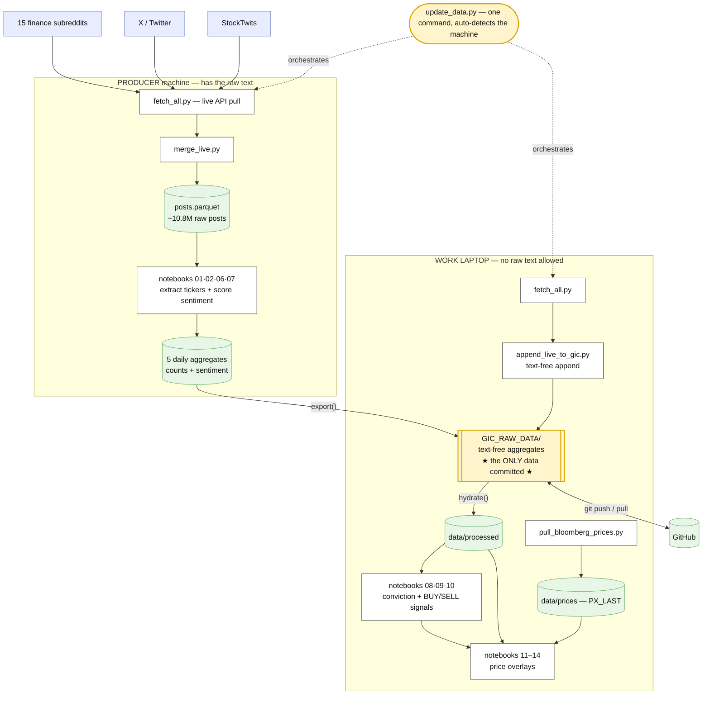

# RetailFlow — retail attention → signals → price

Measure how much retail attention each stock **ticker** and **theme** is getting
across **15 finance subreddits + X (Twitter) + StockTwits**, detect attention
"take-offs" (trailing z-scores), score sentiment, combine the two into a
**conviction score**, and emit **BUY/SELL signals with explicit reasons** — then
overlay it all against **Bloomberg prices** to eyeball whether the crowd leads
the move.

Everything runs from **one command** — `python update_data.py` — which does the
right thing on either machine (it auto-detects). Because the raw posts can't
leave the machine they live on, the pipeline is split where *text becomes
numbers*: the heavy text work runs where the raw data is, and only small
**text-free aggregates** (`GIC_RAW_DATA/`) are committed and shared.

## How it works today



**The window is the one knob.** Edit `START_DATE` / `END_DATE` at the top of
`update_data.py`: leave `END_DATE = ""` for **live** (up to today), or set a date
to **freeze a past regime** for backtesting. The same two dates drive the
notebooks and the Bloomberg pull. Full command cheat-sheet:
**[RUNBOOK.md](RUNBOOK.md)**.

## Three-stage Retail Flow Tracker

- **Stage 1 (done) — attention + price.** Mentions across Reddit/X/StockTwits,
  take-off detection, ticker/theme sentiment, conviction, BUY/SELL signals, and
  Bloomberg price overlays to eyeball lead/lag.
- **Stage 2 — sentiment upgrade** (FinTwitBERT, calibrated on StockTwits' own
  bull/bear labels) if the VADER + WSB lexicon proves too noisy.
- **Stage 3 — influence tracking** of individual accounts and subreddits (spec
  in `weekly_task_lists/WEEK5_6_INFLUENCE_TRACKER_SPEC.md`).

## Folder layout

```
RetailFlow1/
├── update_data.py            # ★ THE one command: edit the window at the top, run it
├── pull_bloomberg_prices.py  # work laptop: pull PX_LAST for the overlays (blpapi)
├── check_live_ingestion.py   # freshness check: what raw/derived/committed data is fresh
├── RUNBOOK.md                # scenario cheat-sheet (live, backtest, bloomberg, setup)
├── requirements.txt
├── GIC_RAW_DATA/             # ★ the ONLY committed data: 5 text-free aggregates (~2 MB)
├── api_calls/                # live API pulls
│   ├── fetch_all.py          #   key check + calls every keyed source + auto-append
│   ├── fetch_reddit_live.py  #   FetchLayer (or official Reddit OAuth)
│   ├── fetch_stocktwits.py   #   public StockTwits API (no key)
│   ├── fetch_x_live.py       #   X v2 API (armed; on when X_BEARER_TOKEN is set)
│   ├── append_live_to_gic.py #   fold new posts into GIC_RAW_DATA (keeps NO raw text)
│   └── test_fetchlayer.py    #   one-credit key test (fetch_all --test)
├── data/                     # everything here is gitignored EXCEPT reference/
│   ├── raw/                  #   immutable .zst dumps + live raw (transient)
│   ├── processed/            #   posts.parquet + the 5 daily aggregates
│   ├── prices/               #   Bloomberg PX_LAST (stays local — licensing)
│   └── reference/            #   Nasdaq lists + ticker_classification.csv (committed)
├── data_ingestion/
│   ├── LIVE_INGESTION.md     # keys, rate limits, cadences, Task Scheduler
│   └── scripts/
│       ├── prep_posts.py     #   raw .zst dumps -> posts.parquet (one-time backfill)
│       ├── fetch_x_data.py   #   download the 3 HuggingFace X datasets
│       ├── add_x_data.py     #   rebuild the X block of posts.parquet
│       └── merge_live.py     #   append live raw into posts.parquet (producer)
├── notebooks/
│   ├── 01–05   clean -> mentions -> take-offs, tickers & themes   (PRODUCER: needs raw)
│   ├── 06–07   ticker / theme sentiment (VADER + WSB lexicon)     (PRODUCER: needs raw)
│   ├── 08–09   ticker / theme conviction (mentions × sentiment)
│   ├── 10      BUY/SELL trading signals (conviction 0–5 + reasons)
│   └── 11–14   Bloomberg price overlays (mentions / derivative / conviction / signals)
├── src/
│   ├── gic_data.py           # ★ export/hydrate + text-free aggregation & merge math
│   ├── clean_data.py x_data.py stocktwits_data.py reddit_live_data.py  # normalisers
│   ├── extract_tickers.py screen_tickers.py ticker_universe.py         # ticker logic
│   ├── build_mentions.py inflection.py sentiment.py themes.py          # signals logic
├── dashboard/app.py          # Streamlit dashboard over the aggregates
└── tests/test_pipeline.py    # pytest checks for dataset + pipeline + notebooks
```

## One-time setup

```bash
cd RetailFlow1
python3 -m venv .venv
source .venv/bin/activate          # Windows: .venv\Scripts\activate
pip install -r requirements.txt
jupyter notebook                   # opens the notebooks in your browser
```

## Where do I put my data?

Drop any of these into **`data/raw/`** (a folder can hold many files):

| File type | Example | Notes |
|-----------|---------|-------|
| `.zst`    | `wallstreetbets_submissions.zst` | The Pushshift / Reddit torrent format. Read straight away, no need to unzip. |
| `.ndjson` / `.jsonl` | one JSON post per line | Same content, uncompressed. |
| `.csv` / `.parquet`  | a Kaggle/HuggingFace export | Any flat table of posts. |

Then run `python3 data_ingestion/scripts/prep_posts.py` once — it streams,
cleans, dedupes and merges everything into `data/processed/posts.parquet`.
The notebooks never touch the raw files.

### X (Twitter) data — the second source

Besides Reddit, the dataset carries X posts from **three** HuggingFace
datasets, all registered in `src/x_data.py` (`DATASETS`):

| registry key | HF dataset | rows | period | engagement |
|---|---|---|---|---|
| `financial_tweets` | StephanAkkerman/financial-tweets | ~315k | Nov 2023+ | none (score 0) |
| `stock_market_tweets_data` | StephanAkkerman/stock-market-tweets-data | ~924k | Apr–Jul 2020 | none (score 0) |
| `stock_market_tweets` | mjw/stock_market_tweets | millions | 2015–2020 | likes → score, comments → num_comments |

Two scripts, in order (safe to re-run any time):

```bash
python data_ingestion/scripts/fetch_x_data.py  # downloads each -> data/raw/X Data/<key>.csv.zst (raw, immutable; existing files skipped)
python data_ingestion/scripts/add_x_data.py    # REBUILDS the whole X block of posts.parquet from all raw files
```

`add_x_data.py` is **idempotent**: every run keeps the Reddit rows and
rebuilds all X rows from whatever raw files exist — so adding a fourth
dataset later is one normaliser + one registry line in `src/x_data.py`,
then re-run both scripts. No new pipeline files, no duplicated tweets
(dedup on id across datasets, "first seen wins"; real tweet ids are
prefixed `x_`, row-number ids `x_smt_`, so nothing can collide with
Reddit's base36 ids).

After the merge every row carries a **`source` column** (`'reddit'` or
`'x'`); X rows also get `subreddit = 'x_twitter'` so subreddit filters and
the parquet's block layout keep working. Tweet text goes into `title`.
The `score` field is populated only where the source provides it (Reddit,
plus the mjw dataset's likes) — all counting uses RAW mention counts
everywhere, so cross-source comparisons are apples to apples. Notebook 02's
**"Reddit vs X — who moves first?"** section plots reddit / x / combined
lines per ticker (7-day rolling, each normalised by its own peak) and
estimates the lead/lag by cross-correlation: corr(reddit[t], x[t−k]) for
k = −14..+14; the best k > 0 means X leads Reddit by k days. All
derivative / z-score analytics (and notebooks 03/05) run on the **combined**
signal. With all three datasets the X coverage is 2015–2020 plus Nov 2023+
(a gap in 2021–2023) — pick comparison windows accordingly. After merging,
pin `EXPECTED_X_ROWS` in `tests/test_pipeline.py` to the exact count
`add_x_data.py` prints.

## How to run

**Notebook 01 — slice + screen (the head of the chain).** The dataset
(`data/processed/posts.parquet`) is already built, so this notebook loads and
slices it — **no `.zst` reading, loads in seconds** — then saves two things
the rest of the chain uses:

1. `data/processed/posts_slice.parquet` — the filtered slice that notebooks
   02 and 04 read. This is how the whole chain shares ONE time window.
2. `data/reference/ticker_classification.csv` — the word-ticker screening
   table (last section of the notebook) that notebook 02's extractor uses to
   ignore words like LOAN/EDGE/RENT unless written as `$cashtags`.

Edit the two parameter cells:

```python
START_DATE  = '2021-01-01'  # inclusive, or None          <- the window for the WHOLE chain
END_DATE    = '2022-01-01'  # EXCLUSIVE, or None
SUBREDDITS  = []      # e.g. ["wallstreetbets"];  [] = ALL 15 subreddits
SLICE_OUT   = ...posts_slice.parquet   # saved by default; 02/04 need it
```

(Rebuilding the parquet from the raw `.zst` dumps is a separate, slow, one-time
step: `python3 data_ingestion/scripts/prep_posts.py` — see
`data_ingestion/README.md`.)

Notebooks 02 and 04 have **no time-window cells of their own** — they read the
slice and refuse to run (with a clear error) if it doesn't exist yet. To change
the analysis window, edit notebook 01 and re-run the chain from there. Tip: the
notebooks are JSON files — if one ever breaks (e.g. hand-edited quotes), restore
it from git.

**Notebook 02 — mentions over time.** Builds daily counts and draws **two graphs**.

```python
TICKERS_TO_PLOT = []   # e.g. ["GME","AMC"];  [] = automatically use TOP_N
TOP_N           = 6
CASHTAGS_ONLY   = False # True = only count $TICKER (cleaner, lower recall)
```

Run it → raw mention charts (one post = 1) plus rolling and z-score views.
Saves `data/processed/daily_ticker_counts.parquet`
(`date, ticker, mention_count`). First run downloads the Nasdaq ticker list;
needs internet.

**Notebook 03 — first derivative.** Finds take-off days.

```python
VALUE_COLUMN = "mention_count"
TICKERS = []     # e.g. ["GME"];  [] = use TOP_N most mentioned
TOP_N   = 4
SMOOTH  = 3      # rolling-average window (bigger = calmer, slower to react)
K       = 2.0    # std-devs above normal = a take-off (lower = more sensitive)
```

Run it → for each ticker: a chart of mentions with red inflection markers, plus
the printed take-off dates.

## Optional: themes instead of single tickers

`src/themes.py` groups tickers (e.g. NVDA + AMD + SMH = "semiconductors"). It
turns the daily ticker counts into daily *theme* counts with the same columns,
so notebook 03 works on themes unchanged:

```bash
python3 -m src.themes --in data/processed/daily_ticker_counts.parquet \
                      --out data/processed/daily_theme_counts.parquet
```

Then point notebook 03's `DAILY_COUNTS_PATH` at the theme file.

**Themes are tradeable by design.** Every theme in `src/themes.py` is
anchored to a liquid instrument in `THEME_ETFS` (semiconductors → SMH,
gold_metals → GLD, uranium_nuclear → URA, europe_defense → EUAD, ...), so
a spike always points at something you can back-test. Vague, untradeable
themes (options chatter, earnings chatter, IPO chatter) were removed;
`short_squeeze`/`meme_stocks` keep GME as an honest single-stock proxy.

## Sentiment (Stage 2 lite — notebooks 06 & 07)

`src/sentiment.py` scores every post with **VADER plus a WSB lexicon**
(moon/calls/tendies bullish; puts/bags/rug/rekt bearish) and rolls it up
per ticker (06) and per theme (07) per day. The headline metric is
**net_bullish ∈ [-1, +1]** = share of bullish posts minus share of bearish
posts — robust to one extreme post, reads as "how one-sided is the crowd".
Noise controls: days under `MIN_POSTS` are masked, charts use 7-day rolling
means, and levels are less trustworthy than changes vs a name's own
baseline (sarcasm defeats lexicons). Theme lines aggregate hundreds of
posts/day and are much more stable than single tickers — which is why the
JPM chart this mimics is sector-level. Scoring runs once (~20–40 min for a
1-year slice) and is cached to `posts_slice_sentiment.parquet`; both
notebooks share the cache. Upgrade path if the signal proves out: swap
VADER for a finance-tuned transformer (FinTwitBERT) behind the same
`score_text()` interface.

## Counting rules

One signal only: raw `mention_count` — the number of distinct posts
mentioning a ticker that day. Per-post deduplication is on: a post
mentioning NVDA 5 times counts as **1 mention** (breadth of attention,
not verbosity). There is deliberately no score-based weighting of any
kind; the reasons live in `design_decisions.xlsx` (#30). Tests enforce
the single-column output. The theme files carry two legacy zero-filled
columns purely so older notebooks keep running.

## Screening word-tickers (`src/screen_tickers.py`)

Many real tickers are also everyday English words — EDGE, LOAN, RENT, TECH,
EARN, OPEN, REAL, CASH... A bare-caps match counts those words as phantom
mentions, and a hand-maintained stop list never ends (there are hundreds of
word-tickers). So the classification is **data-driven**, with two signals:

**Signal 1 — case ratio, measured on our own corpus (primary).** English
words appear mostly lowercase in real posts ("the edge of"); tickers appear
mostly ALL-CAPS ("bought NVDA calls"). For every 4–5-letter symbol in the
universe we count both forms in a post sample and compute
`caps_share = caps / (caps + lower)`. Measured on this dataset: EDGE 0.02,
LOAN 0.002, NVDA 0.93, TSLA 0.93. The distribution is strongly **bimodal**
(most symbols sit near 0 or near 1, few in between) — that gap is what makes
a threshold reliable.

**Signal 2 — wordfreq, general-English frequency (fallback).** If a symbol
has fewer than 30 sightings in the sample, its ratio is noise, so
`zipf_frequency()` from the `wordfreq` package decides instead: "edge" scores
4.7 (common word), "nvda" 2.1 (not a word).

### Design decisions & assumptions

| Decision | Value | Why |
|---|---|---|
| **Corpus beats wordfreq** | signal 1 checked first | Tailored to how Reddit writes. SNAP looks like a word to wordfreq (zipf 4.2) but measures caps_share ≈ 0.56 in the corpus → correctly kept as a ticker. Same protects AMD (zipf 3.5). |
| **Demote, don't delete** | class `cashtag_only` | Demoted tickers still count when written `$LOAN`, so a real attention spike is never lost — only the prose noise. A stop list would delete the signal forever. |
| **caps_share threshold** | 0.5 | The bimodal distribution has its valley roughly between 0.1 and 0.8; 0.5 sits inside it and errs toward precision. |
| **Minimum sightings** | 30 | Below that, one shouty post can flip the ratio. |
| **zipf threshold** | 3.5 | Word-tickers score 4.4–5.1, real tickers ~2.0–2.6. Borderline cases (AMD 3.5) are usually frequent enough to be decided by signal 1 anyway. |
| **Only 4–5 letter symbols screened** | ~9,200 candidates | Only those can collide with the bare-caps regex; 1–3 letter symbols never bare-match by design. |
| **Sample, not full corpus** | 300k posts | Common words are sighted thousands of times in a sample this size; scanning all 7.9M posts changes ratios marginally but costs 25× the time. Sampling is seeded (`random_state=0`) so the CSV is reproducible. |

### Known limitations / thinking points

- **Caps-typed jargon slips through both signals.** HODL (zipf 1.7 — not a
  word; caps_share 0.62 — typed like a ticker) passes both tests. The manual
  `BARE_PROSE_STOP` list in `extract_tickers.py` remains as a third layer for
  exactly these.
- **Brand-name tickers people type lowercase get demoted.** SOFI (0.34),
  HOOD (0.25), COIN (0.04) — lowercase "sofi" is often genuinely about the
  company, so demotion costs some recall. Deliberate: precision-first until
  Stage 2 sentiment; their `$cashtag` mentions always still count.
- **The corpus catches Reddit-specific usage no dictionary would.** ROPE is
  demoted because on WSB it's dark humour, not the ticker — signal 1 gets
  this right where wordfreq alone is borderline (4.1).
- **Ratios are era-dependent.** The notebook measures them on whatever slice
  is loaded (e.g. 2021), the CLI on an all-history sample. Differences are
  small; measuring on your analysis window is arguably a feature.

### How it plugs in

`notebooks/01_clean_data.ipynb` (section "Screen word-tickers") or
`python -m src.screen_tickers` writes
`data/reference/ticker_classification.csv`. `extract_tickers.py` loads it at
import and skips bare-caps matches for every `cashtag_only` ticker — so
notebook 02 and `build_mentions.py` need no changes. If the CSV is missing,
the extractor behaves exactly as before (empty screened set). The layered
defence in the bare-word pass is: universe validation → `STOP_TICKERS`
(jargon, blocks cashtags too) → `BARE_PROSE_STOP` (manual) → `SCREENED_STOP`
(data-driven) — cashtags are exempt from the last two.

## Glossary

- **Mention count** — number of distinct posts that mentioned a ticker on a given day (one post = 1, regardless of how many times the ticker appears in it).
- **Mention count is the only counting signal** — score-based weighting was removed for good (final scores leak future information into day-t signals; design_decisions.xlsx #30).
- **First derivative / velocity** — change in (smoothed) mentions vs. the day
  before. High positive value = attention accelerating.
- **Inflection / take-off day** — a day whose velocity is much higher than that
  ticker's normal day-to-day noise (above `mean + K × std`).
- **Ticker universe** — the official list of real, tradeable US symbols, used so
  ordinary capitalised words (CEO, YOLO) are not mistaken for tickers.
- **Word-ticker** — a valid symbol that is also an everyday English word (EDGE,
  LOAN, RENT). Classified `cashtag_only` by `src/screen_tickers.py`: bare-caps
  mentions are ignored, `$cashtag` mentions still count.


---

## Historical vs. live data — how ingestion evolves

The `.zst` dumps are a **one-time historical backfill** (they end in 2025 and
never change). Keep them in `data/raw/` as the immutable source of truth: if
the cleaning rules ever change (new columns, dedupe, different filters),
rebuild `posts.parquet` from them rather than editing the parquet.

**Live/future data will not arrive as `.zst`.** Per Stage 1 step 7, new posts
come from the Reddit API (PRAW) as JSON. Two sensible patterns for appending:

1. **Append to the one parquet** — fetch new posts, run them through the same
   `normalise()` in `src/clean_data.py`, skip any post `id` already in the
   dataset (the same "first seen wins" dedup rule `prep_posts.py` uses), and
   append as new row groups. Simple, keeps a single dataset.
2. **Partitioned parquet** (better for continuous ingestion) — write
   daily/monthly files like `posts/2026-07.parquet`; pyarrow/pandas read the
   whole folder as one dataset, and nothing ever rewrites the 1.1 GB file.

Either way, everything downstream only cares about the standard schema
(`id, date, author, score, subreddit, title, selftext, num_comments, source`).
As long as live data is normalised to that shape (with `source` saying where
it came from — `'reddit'`, `'x'`, ...), notebooks 02–05 and the tests work
unchanged.

> **⚠️ Caveat — `score` and `num_comments` are snapshots, not final values.**
> The archive dumps captured posts long after posting, so their scores are
> *mature* (a viral post shows its full 50k upvotes), while a live-fetched
> post grabbed minutes after creation has a score near 0 — even if it later
> goes viral. The stored `score` column is therefore **not comparable across
> eras** and must never be turned into a counting signal (that decision is
> final — see design_decisions.xlsx #30). All counting uses raw
> `mention_count`: one post = 1 either way, immune by construction.

---

## Manual settings & fallbacks — the live-data checklist

Everything in this table was set BY HAND for the historical back-test.
Each one is fine today and each one can silently produce weird results
once live ingestion starts. **Walk this list before and after switching
on live data.**

### A. Manually set time windows

| Setting | Where | Current | What goes wrong live |
|---|---|---|---|
| TIME WINDOW (`START_DATE`/`END_DATE`) | notebook 01 (single source of truth for the whole chain) | fixed historical window | New live posts silently EXCLUDED until you extend the window and re-run 01 → the chain looks "frozen in time" while data keeps arriving |
| Date-range assertion | `tests/test_pipeline.py` (`dates.max() <= "2026-01-01"`) | pinned | **Will start failing the day live data crosses 2026-01-01.** Bump deliberately — it exists to catch garbage timestamps, so raise it, don't delete it |
| X coverage map | the three static HF dumps | 2015→mid-2020 + Nov 2023→(snapshot end); **gap 2021-2023** | The X dumps are frozen snapshots: live Reddit will keep growing while X stops at its snapshot date → Reddit-vs-X comparisons beyond that date are meaningless, not "X went quiet" |
| Rolling-z warm-up | notebook 02 (`Z_MIN_DAYS`=28) | 28 days | First month after ANY window start (incl. live go-live date) has NO z-scores — not missing data, just warm-up |
| MAGS inception | `data/prices/MAGS.csv` | Apr 2023 | Backtests on earlier windows must exclude MAGS |

### B. Sampled / estimated outputs (seeded fallbacks)

| Setting | Where | Current | What goes wrong live |
|---|---|---|---|
| `MAX_SCORE_POSTS` sentiment cap | notebooks 06/07 | 500,000 posts, seed 0 | Post-volume panels show SCORED posts (proportional, not absolute); sentiment shares are ±1-2pt estimates. Set `None` for exact runs. Keep 06/07 identical so they share one cache |
| Sentiment cache validity | 06/07 (row-count match) | — | After ANY new ingestion, delete `posts_slice_sentiment.parquet` (or re-run 01 so the row count changes) — a stale cache scores yesterday's world |
| `SCREEN_SAMPLE_SIZE` word-ticker screening | notebook 01 | 300,000 posts, seed 0 | Case ratios are era-dependent: after live data (or a window change) re-run the screening section so `ticker_classification.csv` reflects current language |

### C. Pinned test expectations (update on purpose, never casually)

| Setting | Where | Current | What goes wrong live |
|---|---|---|---|
| `EXPECTED_TOTAL_ROWS` (reddit) | tests | 7,954,297 | Any live append changes it → tests fail LOUDLY (by design). Update the pin with each deliberate ingestion, record the date |
| `EXPECTED_X_ROWS` | tests | pin after each merge | Same — the merge script prints the number to pin |
| Duplicate ceiling | tests (≤ 5) | 5 known rows | Live dedup must keep "first seen wins"; a rising count means the live pipeline is re-ingesting known ids |

### D. Manually curated lists (need periodic refresh)

| List | Where | Refresh trigger |
|---|---|---|
| `STOP_TICKERS` / `BARE_PROSE_STOP` | `src/extract_tickers.py` | New caps-jargon slips past both screening signals (HODL/TLDR class) — check notebook 02's top-20 after each new era of data |
| `ticker_classification.csv` | generated by notebook 01 | Regenerate after window changes or new ingestion; extractor loads it AT IMPORT — restart/reload kernels after regenerating |
| Nasdaq ticker universe cache | `data/reference/*.txt` (max age 365d in notebooks) | New IPOs invisible until refresh — delete the cached .txt files to force a re-download |
| `DELISTED_TICKERS` survivorship supplement | `src/ticker_universe.py` | Today's symbol files omit delisted names (BBBY, SPRT...), silently dropping the meme casualties from history — bias that flatters backtests. The hand-curated supplement re-adds them; extend it when a name you KNOW was loud fails to appear in notebook 02. Proper fix eventually: point-in-time universe snapshots |
| `THEME_KEYWORDS` / `THEME_TICKERS` / `THEME_ETFS` | `src/themes.py` | New themes/ETFs by hand; every theme MUST get an ETF anchor (pytest enforces) |
| `WSB_LEXICON` sentiment slang | `src/sentiment.py` | Slang drifts; new terms need hand-set valences, then delete the sentiment cache |

### E. Thresholds set by judgement, awaiting calibration

`K=2.0` (take-off, calibrate vs prices in Stage 1 step 5), `SMOOTH=3`,
`EWMA_SPAN=14`, `K_SMOOTH=2.5`, `PEAK_PROMINENCE=0.75`, `MIN_TOTAL=300`,
screening thresholds (`caps_share<0.5`, `MIN_SIGHTINGS=30`, `zipf>=3.5`),
sentiment floors (`MIN_POSTS` 5 ticker / 20 theme, `ROLL=7`,
bull/bear cutoffs ±0.05). None are data-derived guarantees — all are
documented judgement calls (see `design_decisions.xlsx` for the why).

### F. Live-ingestion specific traps (from earlier sections, collected)

1. **Score maturity**: live scores are ~0 at fetch vs mature archive scores —
   the stored `score` column is not comparable across eras and must never
   become a counting signal (see caveat box above). All counting is raw
   mention counts, which are immune.
2. **Windows file locks**: close Jupyter kernels before any parquet swap
   (`add_x_data.py` prints recovery steps if it hits a lock).
3. **The dedup rule is a contract**: live PRAW ingestion must skip ids that
   already exist ("first seen wins"), or duplicate counting corrupts every
   downstream signal.
4. **`add_x_data.py` rebuilds the X block from the raw dumps on every run** —
   a future live X source must be added as a registry entry with its own
   raw file, not by editing the parquet.

## Potential errors & how to mitigate them

Known ways this signal can lie, and what to do about each:

| Risk | What goes wrong | Mitigation |
|---|---|---|
| **Bot posting / spam** | Pump groups flood a sub with low-effort posts mentioning a ticker; raw `mention_count` spikes with no real crowd behind it | Per-post dedupe is already on (a post counts once). Add: minimum-score filter (e.g. drop `score < 2`), cap posts-per-author-per-day (a user posting $XYZ 30×/day counts once), and cross-check that a spike appears in **more than one** subreddit before trusting it |
| **Score maturity bias** | Archived posts carry final/mature scores; live posts have near-zero scores at fetch time — the stored `score` column is not comparable across eras | Resolved by design: score-based counting was removed entirely (design_decisions.xlsx #30); all signals use raw `mention_count`, which is immune (one post = 1 the moment it exists). The `score` column stays in the schema for spam filtering only (e.g. drop `score < 2`) |
| **Selection bias** | Mega-caps (NVDA, TSLA) are always heavily mentioned, so their "spikes" are less meaningful | The inflection detector already normalizes per ticker (`mean + K×std` of its *own* history). Also prefer *velocity* (change) over *level* (absolute counts) when comparing tickers |
| **False-positive tickers** | Bare words like ALL, NOW, EDGE, LOAN are valid symbols → phantom mentions | Three layers in `extract_tickers.py`: universe validation, manual stop lists, and data-driven screening (`src/screen_tickers.py` — case ratio + wordfreq, see "Screening word-tickers"). When precision matters more than volume, run with `CASHTAGS_ONLY = True` ($TICKER only) |
| **Deleted/removed posts** | Archive keeps posts later deleted by mods; live API won't return them → historical counts slightly higher | Small effect; note it when back-testing. Optionally drop posts with `selftext == "[removed]"` for consistency |
| **Direction blindness** | A mention spike says *attention*, not *bullish vs bearish* — GME puts and calls look identical | That's Stage 2 (sentiment). Until then, treat spikes as "look here", not "buy signal" |
| **Duplicate/crosspost inflation** | The same content posted across subs counts once per sub | Acceptable if you *want* breadth-of-attention; to remove it, dedupe on identical `title` within a day |

---

## Stage 1 status

The full Stage-1 loop is **built and running** — one command
(`python update_data.py`) refreshes it end to end:

| Piece | Where | State |
|---|---|---|
| Mentions & themes | notebooks 02 / 04 (Reddit + X + StockTwits) | ✅ |
| Take-off detection | notebooks 03 / 05 (trailing z-scores, live-parity) | ✅ |
| Sentiment | notebooks 06 / 07 (VADER + WSB lexicon) | ✅ |
| Conviction + BUY/SELL signals | notebooks 08 / 09 / 10 (reasons attached) | ✅ |
| Price overlays | `pull_bloomberg_prices.py` + notebooks 11–14 (PX_LAST) | ✅ |
| Live ingestion | `update_data.py` → `GIC_RAW_DATA` (text-free) | ✅ |

The four proposal ETFs already map to themes: **GLD → `gold_metals`,
MAGS → `ai_megacap`, BTC → `crypto`, SMH → `semiconductors`**.

What's left is **judgement, not plumbing**: open the overlay notebooks (11–14),
read whether attention leads price cleanly enough, and — if raw mentions prove
too noisy — trigger the **Stage 2** sentiment upgrade (FinTwitBERT, calibrated
on StockTwits' own bull/bear labels).
